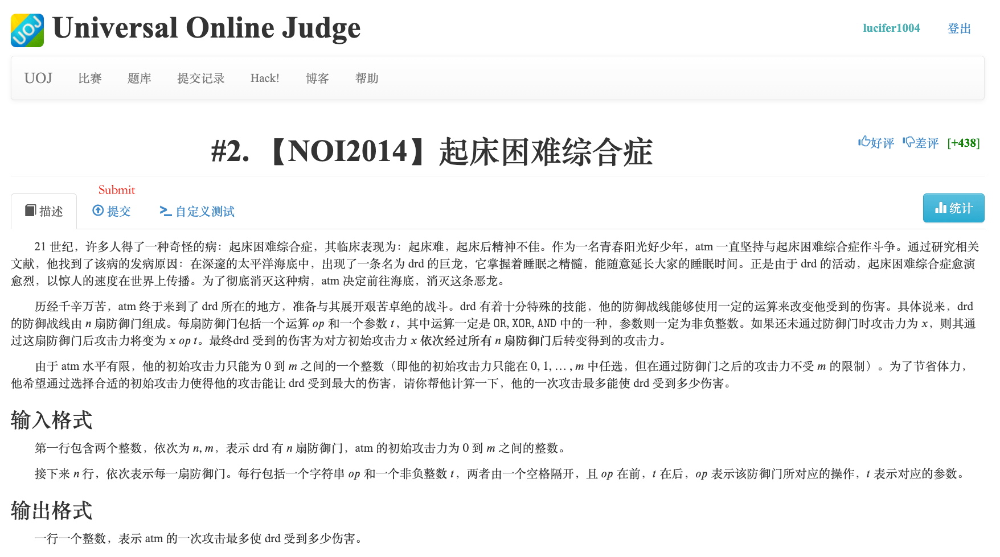
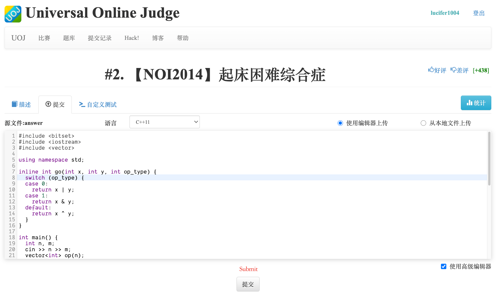

# About Universal Online Judge

Universal Online Judge (UOJ) is a famous OJ platform in China, with hundreds of high-quality problems. 

## Registration

1. Go to [UOJ](http://uoj.ac/), and click "注册" (Register)

2. Input your information on the page you are redirected to.

3. You have successfully created your UOJ account! You can now go back to the home page and sign in with the new account.

## Submission

After signing in, you can go to a specific problem and submit your solution.

Click "提交" (Submit) to go to the online IDE.

Then click the "提交" (Submit) button at the bottom to submit your answer.

## Shortcuts

- [UOJ002 - Hard to Get Up](./002/)
- [UOJ003 - Magic Forest](./003/)

<Utterances />
